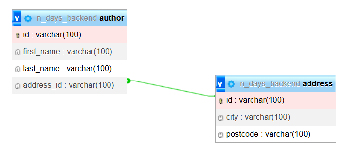

# One-to-One Relation

Hubungan antara dua entitas di mana setiap rekaman dalam satu entitas dapat dikaitkan dengan paling banyak satu rekaman pada entitas lain, dan sebaliknya

## Implementasi pada Program



Membuat relasi one-to-one antara author dengan address, author merupakan parent dari address sehingga parent memiliki foreign key dari address

Pada [Entity Author](/Project/Day%200/main/src/main/kotlin/ndays/backend/main/entity/Author.kt) terdapat atribut address
```kotlin
@Entity
@Table(name = "author")
data class Author(
    @Id
    val id: String,
    @Column(name = "first_name")
    var firstName: String,
    @Column(name = "last_name")
    var lastName: String,

    @OneToOne(cascade = [CascadeType.ALL], orphanRemoval = true)
    @JoinColumn(name = "address_id", referencedColumnName = "id")
    val address: Address
)
```
- Atribut tersebut berfungsi untuk menandai bahwa table tersebut memiliki relasi dengan table lainnya
- Anotasi `@OneToOne` digunakan untuk digunakan untuk memberi tahu program bahwa class Author memiliki relasi one to one
  - argument `CascadeType.ALL` menentukan bagaimana operasi pada entity induk memengaruhi entity anak
  - parameter `orphanRemoval` dipakai untuk menghapus entity anak ketika sudah tidak direferensikan oleh induknya
- Anotasi `@JoinColumn` untuk menentukan kolom foreign key yang dipakai untuk menghubungkan dua tabel
  - parameter `name` digunakan untuk memberitau kolom foreign key pada table author
  - parameter `referencedColumnName` digunakan untuk kolom di tabel tujuan

Ketika melakukan save pada author dan address kita hanya perlu melakukan safe pada author karena author merupakan parent dari address, setiap operasi yang terjadi pada author maka address juga akan terpengaruh

