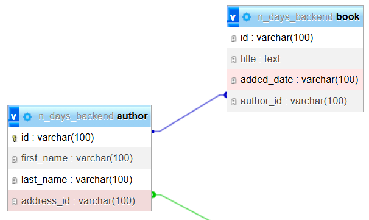

# One-to-Many Relation

koneksi di mana satu entitas dapat dikaitkan dengan beberapa contoh entitas lain, tetapi tiap contoh entitas kedua ditautkan hanya ke satu contoh entitas pertama 

## Implementasi Program


Pada [Entity Author](/Project/Day%200/main/src/main/kotlin/ndays/backend/main/entity/Author.kt) terdapat atribut books yang merupakan representasi dari seluruh kepemilikan book yang dimiliki pleh author
```kotlin
@Entity
@Table(name = "author")
data class Author(
    @Id
    val id: String,
    @Column(name = "first_name")
    var firstName: String,
    @Column(name = "last_name")
    var lastName: String,

    @OneToOne(cascade = [CascadeType.ALL], orphanRemoval = true)
    @JoinColumn(name = "address_id", referencedColumnName = "id")
    val address: Address,


    @OneToMany(mappedBy = "author", cascade = [CascadeType.ALL], fetch = FetchType.LAZY)
    @JsonManagedReference
    val books: List<Book> = mutableListOf()
)
```

Atribut berfungsi untuk menandai kepemilikan author terhadap book
- anotasi `@OneToMany` digunakan untuk memberi tau program bahwa class memililiki relasi one to many pada class lainnya
  - parameter `mappedBy = "author"` menunjukan foreign key ada pada class lainnya yaitu class book
  - argument `CascadeType.ALL` menentukan bagaimana operasi pada entity induk memengaruhi entity anak
  - argument `fetch = FetchType.LAZY` mengatur cara Hibernate memuat data relasi. `Lazy` membuat books tidak langsing dipanggil
- anotasi `@JsonManagedReference` agar tidak infinite reqursion saat JSON serialization


Pada [Entity Book](/Project/Day%200/main/src/main/kotlin/ndays/backend/main/entity/Book.kt) terdapat atribut author
```kotlin
@Entity
@Table(name = "book")
data class Book(
    @Id
    val id: String,

    @Column(name = "title")
    var title: String,

    @Column(name = "added_date")
    var addedDate: String,


    @ManyToOne(fetch = FetchType.LAZY)
    @JoinColumn(name = "author_id")
    @JsonManagedReference
    val author: Author? = null
)
```

atribut tersebut menandai author pemilik book
- anotasi `@ManyToOne` menunjukkan class tersebut memiliki relasi many to one kepada class lainnya
- anotasi `@JoinColumn` untuk menentukan kolom foreign key yang dipakai untuk menghubungkan dua tabel
- anotasi `@JsonManagedReference` agar tidak infinite reqursion saat JSON serialization
