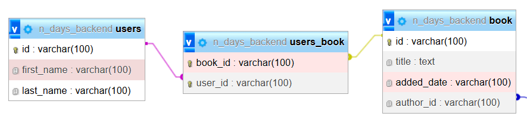

# Many-to-Many Relation

Relasi antar dua entitas (atau tabel) di mana setiap entitas dapat memiliki nol atau lebih entitas dari tabel lain, dan sebaliknya.


## Implementasi pada Program

Membuat relasi many to may antara book dan user dengan tabel users_book sebagai penghubung

Pada  Entity User terdapat atribut books yang digunakan untuk merepresentasikan relasi many to many
```kotlin
@Entity
@Table(name = "users")
class User(
    @Id
    val id: String,

    @Column(name = "first_name")
    var firstName: String,

    @Column(name = "last_name")
    var lastName:String,

    @ManyToMany
    @JoinTable(name = "users_book",
        joinColumns = [JoinColumn(name = "user_id")],
        inverseJoinColumns = [JoinColumn(name = "book_id")])
    @JsonManagedReference
    val book: MutableSet<Book> = mutableSetOf()
)
```
- Anotasi `@ManyToMany` memberitahu JPA bahwa entitas user memiliki relasi many to many
- Anotasi `@JoinTable` membuat tabel perantara untuk menyimpan relasi karena basis data tidak mendukung relasi many to many
  - Parameter `name = "users_book"` digunakan untuk memberi tahu JPA nama tabel perantara
  - Parameter `joinColumns = [JoinColumn(name = "user_id")]` sebagai foreign key dari tabel pemilik
  - Parameter `inverseJoinColumns = [JoinColumn(name = "book_id")]` sebagai foreign key dari tabel lawan
- Anotasi `@JsonManagedReference` digunakan sebagai mengatasi infinity  looping pada json 

Pada entity Book terdapat atribut user yang digunakan untuk merepresentasikan relasi many to many
```kotlin
@Entity
@Table(name = "book")
class Book(
    @Id
    val id: String,

    @Column(name = "title")
    var title: String,

    @Column(name = "added_date")
    var addedDate: String,


    @ManyToOne(fetch = FetchType.LAZY)
    @JoinColumn(name = "author_id")
    @JsonManagedReference
    val author: Author? = null,


    @ManyToMany(mappedBy = "book")
    @JsonManagedReference
    val user: MutableSet<User> = mutableSetOf()
)
```
- Anotasi `@ManyToMany` memberitahu JPA bahwa entitas bok memiliki relasi many to many
  - Parameter `mappedBy = "book"` menandai bahwa variabel tersebut merupakan cermin data dari sisi User
- Anotasi `@JsonManagedReference` digunakan sebagai mengatasi infinity  looping pada json 


